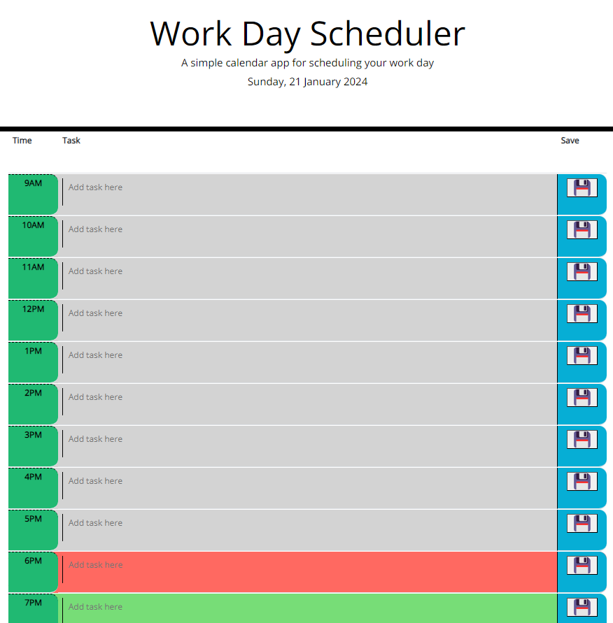
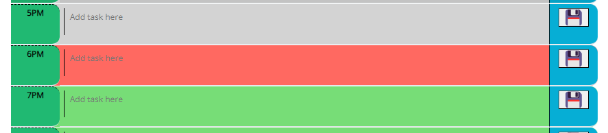

# Daily-ToDo-List
The daily planner that will make you king at time management!

## Description 

This particular project is a simple calendar application that allows a user to save tasks for each hour of the day for standard business hours. Tasks for the day will stay online even if the page is closed or refreshed. So, make the most of this tool and have a productive day!

URL: https://eiteltchap.github.io/Daily-ToDo-List/

## Installation

N/A

## Usage 

* At the start of the day, input all the tasks you have planned to do by clicking a timeblock.

* The color code feature helps you keep track of where you are in the day, so be sure to complete each task on time!
    * Grey - past tasks
    * Red - present task
    * Green - future task

* Press the save button at the right side of the task to save it to your local storage. This way, it won't get lost if the page is closed or refreshed.

## Credits

N/A

## License

Please refer to the LICENSE in the repo.

---
© 2024 edX Boot Camps LLC. Confidential and Proprietary. All Rights Reserved.